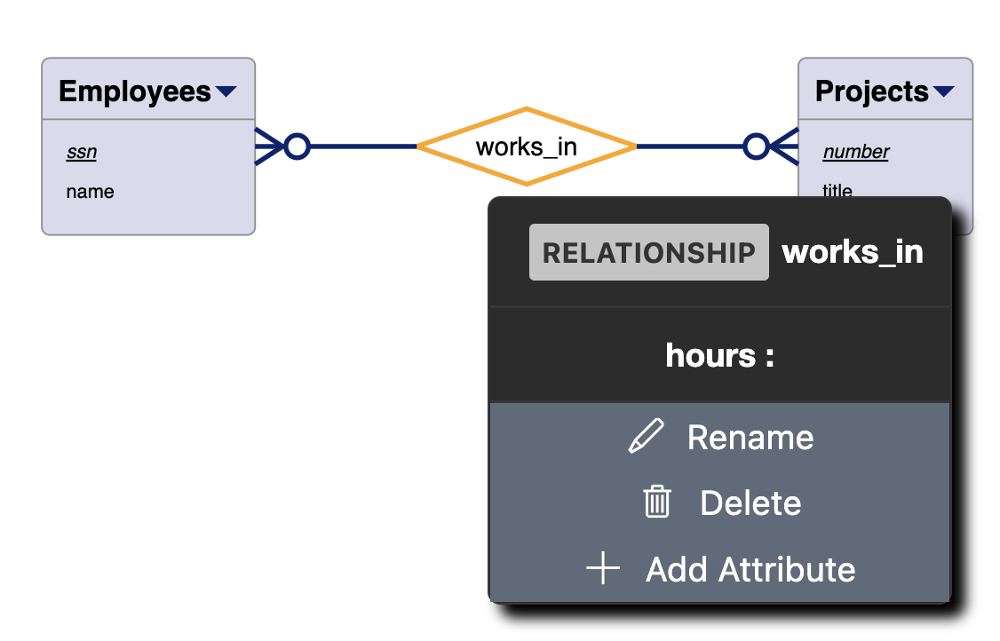

Derive a relational model from each of the ERDs below. 

## Practice #1

```
erdiagram courses
notation=crowsfoot

entity Students {
    id key
    name 
}

entity Courses { 
    number key
    title
}

relationship enrolls_in {
    Students[0..N] -> Courses[0..N]
}
```


## Practice #2

```
erdiagram buildings
notation=crowsfoot

entity Buildings {
    name key
    address
}

weak entity Rooms { 
    floor partial-key
    number partial-key
}

weak relationship has {
    Buildings[1] -> Rooms[0..N]
}
```


## Practice #3

```
erdiagram candidates
notation=crowsfoot

entity Candidates {
    ssn key
    name 
}

entity JobPositions { 
    number key 
    title 
    department 
}

relationship applies_for {
    Candidates[0..N] -> JobPositions[0..N]
}
```


## Practice #4

```
erdiagram buildings
notation=crowsfoot

entity Employees {
    ssn key 
    name 
}

entity Projects { 
    number key 
    title 
}

relationship works_in {
    Employees[0..N] -> Projects[0..N]
    hours
}
```




## Practice #5

```
erdiagram shippings
notation=crowsfoot

entity Shippings {
    order_number key 
    address
}

weak entity Items { 
    seq_number partial-key
    description 
}

weak relationship has { 
    Shippings[1] -> Items[0..N]
}
```


