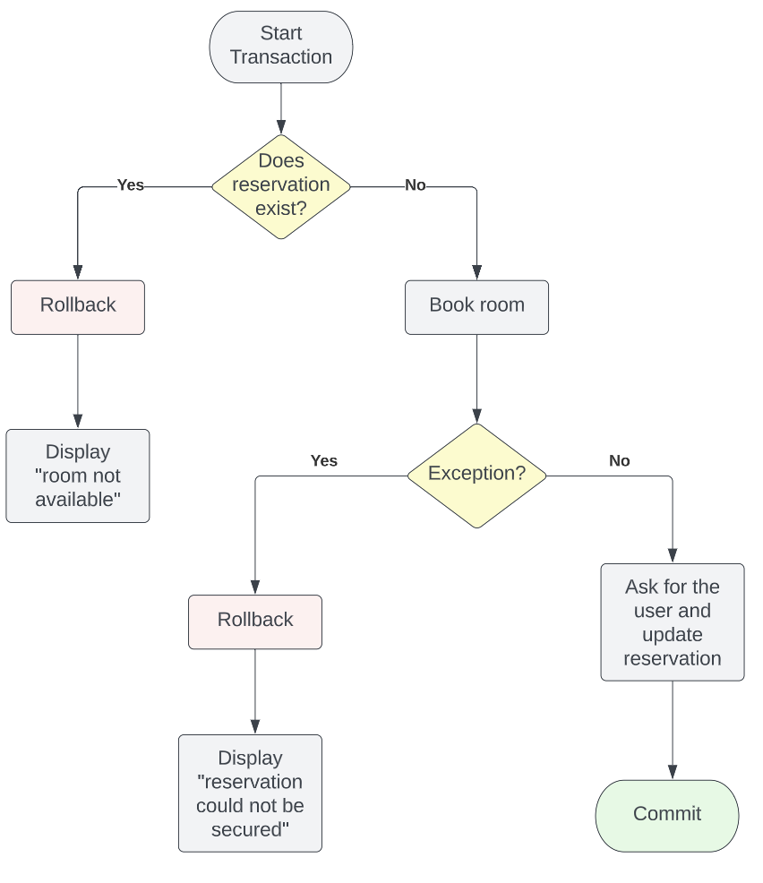
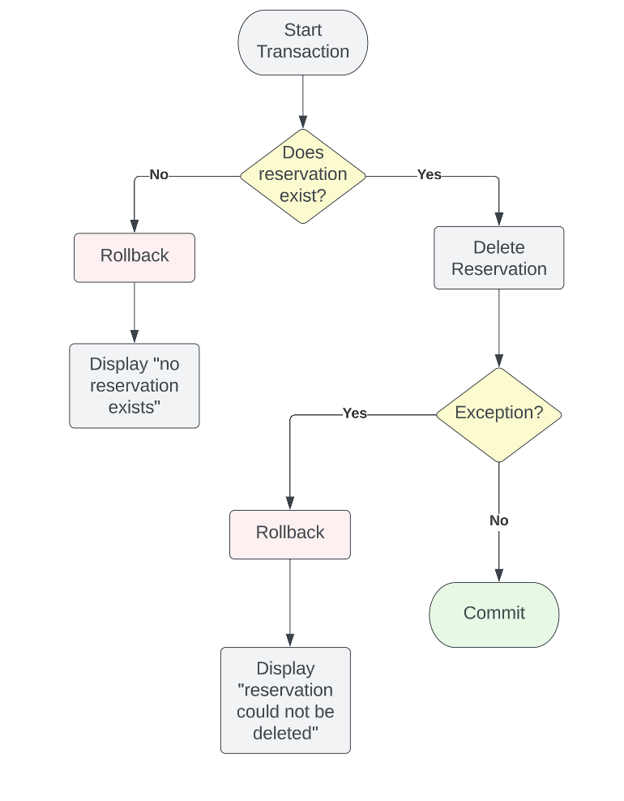

# Instructions 

This project assignment asks you to finish the implementation of a simple room reservation system. Begin the project by creating the database named **booking** and specified in **booking.sql**.  After all tables are created and populated, finish the first TO-DO by creating a view named **ReservationsView** according to the instructions. 

Create a virtual environment and, after its activation, install the **configparser** and **psycopg** modules. Then copy the script template **booking.py** to your virtual environment folder. The booking application implements the following menu of options: 

```
1. List
2. Reserve
3. Delete
4. Quit
```

Each of the options are explained in the sections below. 

# List Reservations 

This option aims to display all of the reservations using the **ReservationsView** created previously. The output could be similar to the following: 

```
code,date,period,start,end,building-room,user
4,2023-06-23,F,16:00,18:00,JSS-230,James Brandy
3,2023-06-23,E,14:00,16:00,AES-220,Morbid Mojito
2,2023-06-12,D,12:00,14:00,AES-210,Sam Mai Tai
1,2023-05-15,C,10:00,12:00,AES-210,Sam Mai Tai
```

# Make a New Reservation 

To make a new reservation, one has to first gather all parameters needed for a reservation, which includes: 

* the date, 
* the period of the day (A-H), 
* the building abbreviation, and 
* the room number.

When making a new reservation it is necessary to define a transaction because more than one statement need to be executed: 

* first, the system needs to check if the room is available for the desired date and period of time; 
* if the room is indeed available, the new reservation must be entered in the system (to secure the booking);  
* if the booking can be secured, the system still needs to update the new reservation with the user info (who's booking the room);
* if the booking cannot be secured, the transaction needs to be undone (rollback). 

Record that the default isolation level for transactions in postgres is **read committed**. Unfortunately, this isolation level does not give an implicit exclusive lock (needed when securing the booking). Therefore, there is a potential risk of more than one user booking the same room on the same day and time. To avoid this problem, your reservation procedure must define the transaction isolation level as **serializable**. In psycopg this is done issuing on the connection object **conn**: 

```
conn.isolation_level = extensions.ISOLATION_LEVEL_SERIALIZABLE
```

The flowchart below explains in detail how you should implement make new reservation. 



# Delete a Reservation

To delete an existing reservation, ask the user for the reservation code. Then start a transaction by checking if there is a reservation with that code. If yes, delete the reservation and commit the transaction. If there is an exception while trying to delete the reservation, or if there is no reservation with the given code, rollback the transaction and terminate the procedure. The flowchart below describes how to delete a reservation. 



# Testing

Make sure you simulate concurrent attemps to reserve the same room. For example, start a new reservation and, before you enter the user information, run a second attemp to reserve the same room, at the same date and period. You should get a message saying that the room is not available even though the first transaction is yet to be commited.  

# Prepared Statements 

To speed-up coding for this assignment, the following prepared statements were shared: 

* QueryReservationExists: tries to retrieve a reservation with parameters (building, room, date, and period)
* QueryReservationExistsByCode: tries to retrieve a reservation with a given code 
* NewReservation: creates a new reservation with parameters (building, room, date, and period)
* UpdateReservationUser: updates the user of a reservation with parameters (user, building, room, date, and period)
* DeleteReservation: deletes a reservation with a given code

# Submission 

**PLEASE, if working with a partner, ONLY ONE OF YOU NEEDS TO SUBMIT ON CANVAS**. Also, make sure both names are added in the comment section of SQL and s Python files. 

Submit a zip file names **booking.zip** with the following structure: 

```
booking.zip
|__booking.sql
|__booking.py
```

# Rubric

TBD